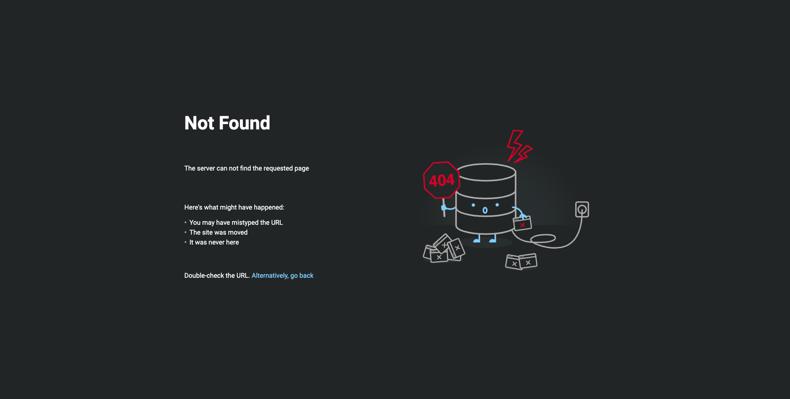

:::tip Prereq
Already deployed:

✅ Docker [swarm cluster](../../swarm-mode.md) with persistent [shared storage](../../shared-storage.md)

✅ [Traefik](./traefik-stack.md)

:::

```yaml
version: '3.9'

services:
  pages:
    image: tarampampam/error-pages:latest
    environment:
      - TEMPLATE_NAME=lost-in-space
    networks:
      - traefik_proxy
    deploy:
      labels:
        - "traefik.enable=true"
        - "traefik.docker.network=traefik_proxy"
        - "traefik.http.routers.error-pages-router.rule=HostRegexp(`{host:.+}`)"
        - "traefik.http.routers.error-pages-router.priority=10"
        - "traefik.http.routers.error-pages-router.entrypoints=https"
        - "traefik.http.services.error-pages-service.loadbalancer.server.port=8080"
        - "traefik.http.middlewares.error-pages.errors.status=400-599"
        - "traefik.http.middlewares.error-pages.errors.service=error-pages-service"
        - "traefik.http.middlewares.error-pages.errors.query=/{status}.html"

networks:
  traefik_proxy:
    external: true
```

## Traefik

Add the Error Pages Middleware
Edit traefik.yaml file

```bash
sudo micro /var/data/traefik/config/traefik.yaml
```

Add middleware


```yaml
# check to be sure you have your middleware set for both http and https
entryPoints:
  http:
    address: ":80"
    http:
      middlewares:
        // highlight-start
        - error-pages@docker
        // highlight-end
  https:
    address: ":443"
    http:
      middlewares:
        // highlight-start
        - error-pages@docker
        // highlight-end
```