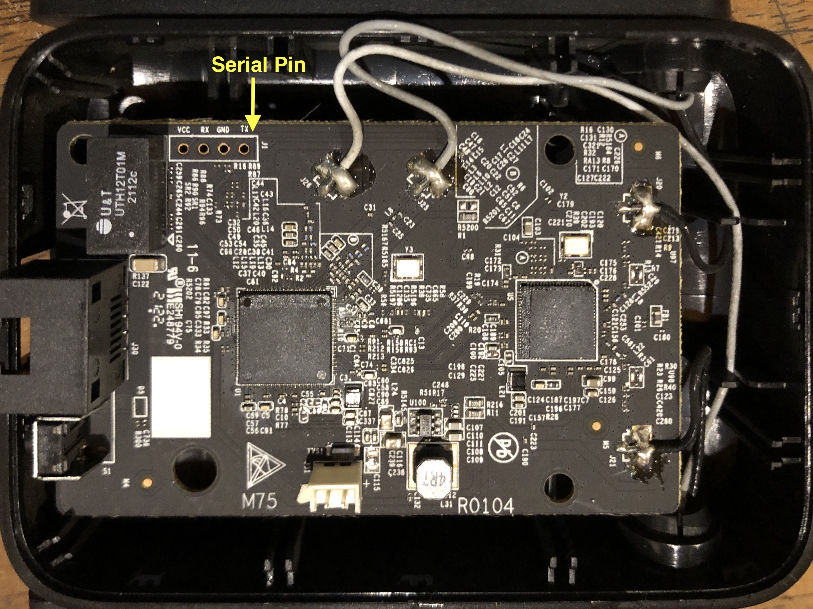

# How To Install OpenWRT on Xiaomi AC1200 Range Extender

## Prerequisites

* USB to TTL
* SFTP Server
* Serial Monitor
* OpenWRT Snapshot Image

Download OpenWRT snapshot [here](https://openwrt.org/toh/views/toh_fwdownload) and search for Model "Mi WiFi Range Extender AC1200 RA75" choose `Factory sysupgrade image`.

## Teardown

There is a single screw under the barcode label, right side. Removing the screw beneath, you can split the unit into the power supply and the wifi part. The 'hot' parts are shielded, no risk of electrical shock.


## Installation

### SFTP Server

Change LAN IP address to `192.168.31.5` subnet `255.255.255.0` leave the rest empty.

Open SFTP App and choose Ethernet Interface.
### Connect USB Serial

Serial connection parameters:

| Connection | Value |
| :---: | :---: |
| Baudrate | 115200 |
| | None |
| | 1 |

Connect usb ttl to board:

| USB TTL | Xiaomi Board |
| :-----: |   :------:   |
| RX      | TX           |
| TX      | RX           |
| GND     | GND          |




### Flash Image

```sh
1: Load system code to SDRAM via TFTP. 
2: Load system code then write to Flash via TFTP. 
3: Boot system code via Flash (default).
4: Enter boot command line interface.
9: Load Boot Loader code then write to Flash via TFTP. 
```

## Reference

[Official Page](https://openwrt.org/inbox/toh/xiaomi/mi_wifi_range_extender_ac1200_model_ra75)

[Forum](https://forum.openwrt.org/t/almost-supported-xiaomi-ra75-aka-miwifi-range-extender-ac1200/134855)

[Photos](https://fccid.io/2AFZZRA75/Internal-Photos/Internal-photos-5364844)